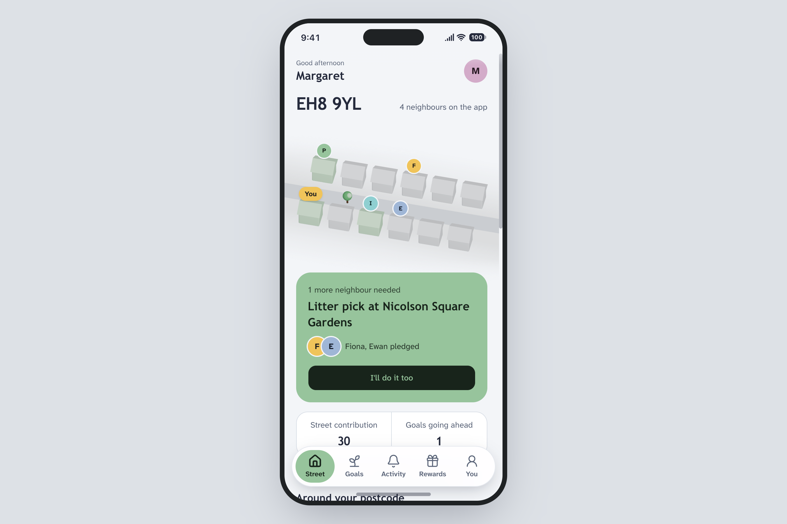
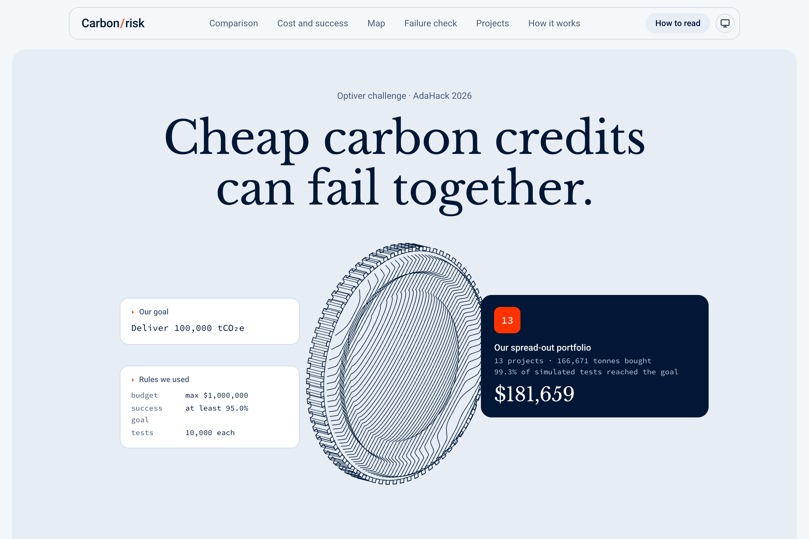

# AdaHack 2026

Three sustainability projects built for Edinburgh Hoppers’ AdaHack on 3 October 2026: helping neighbours act together, prioritising peatland monitoring, and building carbon-credit portfolios resilient to project failures.

## Projects

| Project                  | Challenge        | What it does                                                                                                                  | Explore                |
| ------------------------ | ---------------- | ----------------------------------------------------------------------------------------------------------------------------- | ---------------------- |
| **Greener by postcode**  | Postcode Lottery | Neighbours pledge to shared goals, report participation and redeem demo rewards after organiser confirmation.                 | [Code](apps/postcode/) |
| **PeatPulse**            | CompSoc          | Ranks Scottish peatland locations for satellite-mapped burning within the next seven days using weather and fire-danger data. | [Code](apps/compsoc/)  |
| **Carbon Portfolio Lab** | Optiver          | Compares low-cost carbon-credit portfolios under simulated project failures and shared risks.                                 | [Code](apps/optiver/)  |

## Try the projects

### Greener by postcode

Follow a neighbour from a conditional pledge through attendance reporting, organiser confirmation and reward redemption. The illustrated street becomes greener as households contribute.

[](https://devpost.com/software/greener-dykmap)

[Devpost submission](https://devpost.com/software/greener-dykmap) · [Presentation](https://greener-postcode.vercel.app/presentation)

Run locally using the commands below. The five-slide presentation is at `/presentation` on the running app.

### PeatPulse

Open the [PeatPulse website](https://peatpulse.pages.dev/). **Read the report** explains the data, model, historical results and limitations; **Read the story** opens the presentation.


The cover is an illustration, not a photograph of a study site.

[Devpost submission](https://devpost.com/software/greener-z3j4wi) · [Technical report PDF](devpost/compsoc/PeatPulse-Technical-Report.pdf)

### Carbon Portfolio Lab

Compare three portfolios, change the shared-risk assumption, inspect the map and holdings, and test what remains if an entire exposure group fails.

[](https://devpost.com/software/carbon-portfolio-lab)

[Devpost submission](https://devpost.com/software/carbon-portfolio-lab)

## Run locally

Use Node.js, pnpm **10.32.1**, and uv. Both Python projects pin Python **3.12**; uv can install it when needed. Run all commands from the repository root.

Install the JavaScript dependencies. Optiver’s frontend is a separate pnpm project and needs its own install:

```sh
pnpm install
pnpm --dir apps/optiver/frontend install
```

Install the Python dependencies for backend work and repository checks:

```sh
uv sync --directory apps/compsoc/backend
uv sync --directory apps/optiver/backend
```

Start the project you want to try:

| Project                              | Command                                                                                                       | Local URL                               |
| ------------------------------------ | ------------------------------------------------------------------------------------------------------------- | --------------------------------------- |
| Greener                              | `pnpm dev:postcode`                                                                                           | [localhost:3000](http://localhost:3000) |
| PeatPulse website                    | `uv --directory apps/compsoc/backend run python -m http.server 4317 --bind 127.0.0.1 --directory ../frontend` | [127.0.0.1:4317](http://127.0.0.1:4317) |
| Carbon Portfolio Lab saved dashboard | `pnpm --dir apps/optiver/frontend dev`                                                                        | [localhost:3000](http://localhost:3000) |

Greener and Carbon Portfolio Lab both default to port 3000. To run them together, start Optiver with `pnpm --dir apps/optiver/frontend dev --port 3001` and open [localhost:3001](http://localhost:3001).

To regenerate and audit the Optiver results before launching the dashboard, use `bash apps/optiver/start.sh`. This runs the simulation and may take a few minutes. The [Optiver README](apps/optiver/README.md) covers the Python CLI, exports and modelling assumptions. Serving the PeatPulse website displays saved report pages; it does not rerun the model.

## Repository layout

```text
apps/
  postcode/       Greener Next.js app
  compsoc/        PeatPulse Python backend and static website
  optiver/        Portfolio Python CLI and Next.js dashboard
docs/
  postcode/       Brief, product decisions, status and pitch notes
  compsoc/        Brief, research, results and status
  optiver/        Brief, method, status and judge demo material
  event/          Event description and judging criteria
devpost/          Submission stories and supporting assets
reference/        Organiser challenge PDFs
```

The challenge briefs are recorded in [Postcode Lottery](docs/postcode/brief.md), [CompSoc](docs/compsoc/brief.md) and [Optiver](docs/optiver/brief.md). The [judging criteria](docs/event/judging.md) apply across the event.

## Checks

Check an individual project:

```sh
pnpm verify:postcode
pnpm verify:compsoc
pnpm verify:optiver
```

These commands run the applicable workspace type checks, Python linting and type checks, ESLint and Prettier. Optiver’s separate frontend also needs `pnpm --dir apps/optiver/frontend check`. Use `pnpm verify` for the repository checks. See each project’s instructions for its tests and further validation.

## Demo scope

- **Greener** uses seeded neighbours and activities, saved local environmental information and browser-local state. Rewards and vouchers are fictional. The street visual represents participation; environmental savings have not been measured.
- **PeatPulse** reports a historical ranking comparison against satellite-mapped burning. Its scores are relative rankings, not calibrated fire probabilities. The results do not establish live warning performance or confirmed peat ignition.
- **Carbon Portfolio Lab** displays saved simulation results from challenge data with synthetic prices and failure ratings. Shared-risk strengths and the reliability requirement are demo assumptions. The portfolio search is a bounded heuristic, not a proven global optimum. No credits were purchased or retired, and simulated success rates are not delivery guarantees or measured emissions reductions.
